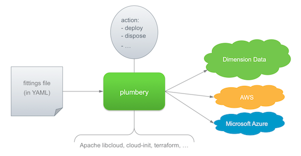

Why plumbery?
=============

Plumbery is an open-source project that was initiated by Dimension Data to accelerate
the digital transformation of our clients.

One day in the life of an ordinary infrastructure manager
---------------------------------------------------------

This project started in response to a very common issue. How to accelerate the
creation, the handling, and the destruction of up to 60 virtual servers
easily? The purpose here is not to supplement Chef, Puppet, and other smart
configuration management that already exist. The first priority is to industrialise
operations on the underlying virtualised iron.

The Plumbery toolbox is based on a central description of servers,
documented in a text file in `YAML`_. If you do not know YAML yet, don't be
afraid, this may be the most simple and user-friendly language for
infrastructure managers. .

Then very simple command is used to act on the infrastructure. For example
you can build the entire set of resources described in the fittings plan
directly from the command line:

.. sourcecode:: bash

    $ python -m plumbery fittings.yaml deploy

This will load the YAML file, parse it, and call the cloud API to make it
happen. Relax, and grab some coffee while plumbery adds network domains,
Ethernet networks, and servers as per your specifications. The engine may plumb
at various data centres spread on Earth, thanks to the power of Apache Libcloud.
Nodes will be started and contextualise with cloud-init directives as well.

Now you can concentrate on important things, connect remotely to the nodes,
play with them, run different tests, etc. At the end of the game, you would
just have to stop all servers and destroy them as per following command:

.. sourcecode:: bash

    $ python -m plumbery fittings.yaml dispose

Infrastructure as code
----------------------

Plumbery fully supports the idea that infrastructure should be handled like code.
For people who have relied for years on the power of physical stuff, this may be a shock.
So let's repeat it again.
When interesting resources have been virtualised and accessed remotely then
suddenly infrastructure managers have new challenges. Infrastructure should be
treated like code is. A lot of best practices are coming with this paradigm.

And issues, too. Becoming a trusted Ops --yes, the second half-part of DevOps-- is not so
easy. How to deal with developers while being not a software developer? Well,
this is exactly why Plumbery has been developed.

Actually we believe that every infrastructure manager should have enough skills
to manage sophisticated configurations with plumbery. Here we are referring to tasks like the following:

* open and edit textual files
* understand and modify configuration files
* connect to a Linux server via ssh
* set environment variables
* run a command from the prompt line
* execute a python program

Infrastructure as code at Dimension Data with Apache Libcloud
-------------------------------------------------------------

If infrastructure should be handled like code, then your first task is to
document a target deployment into a text file. In the context of Plumbery, this
is called the fittings plan, and it is commonly put into a file
named ``fittings.yaml``. This is also called the fittings file.

With that in hands, you can then ask Plumbery to act on the infrastructure and
on nodes. The engine has built-in code to cover the full life cycle:

* deploy the infrastructure and configure it
* build nodes
* start nodes
* stop nodes
* destroy nodes
* dispose the infrastructure and release all resources

What should be described in the fittings plan?
----------------------------------------------

Most, if not all, elements of Dimension Data cloud services, can be handled
by plumbery. This is covering:

* Network Domains
* Networks
* Private IP addresses
* Public IP addresses
* NAT rules
* Firewall rules
* Cloud Servers
* Load-Balancers
* Monitoring dashboard
* Cloud Backup

Plumbery has been extended so that it can handle external cloud services and act within cloud nodes:

* terraform - orchestrate resources at AWS or ar Microsoft Azure
* cloud-init - configure the operating system, files, and applications

The fittings plan is written in YAML, and it
must have multiple documents in it. The first document provides
general configuration parameters for the engine. Subsequent documents
describe the various locations for the fittings.

An example of a minimum fittings plan:

.. sourcecode:: yaml

    locationId: EU6
    regionId: dd-eu

    blueprints:

      - myBluePrint:
          domain:
            name: myDC
          ethernet:
            name: myVLAN
            subnet: 10.1.10.0
          nodes:
            - myServer

In this example, the plan is to deploy a single node in the data centre
at Frankfurt, in Europe. The node `myServer` will be placed in a
network named `myVLAN`, and the network will be part of a network
domain acting as a virtual data centre, `myDC`. The blueprint has a
name, `myBluePrint`, so that it can be handled independently from
other blueprints.

To learn more: :doc:`fittings`

How to run Plumbery?
--------------------

.. toctree::
   :maxdepth: 2

   using.shell
   using.docker
   using.python

.. _`YAML`: https://en.wikipedia.org/wiki/YAML
.. _`available on PyPi`: https://pypi.python.org/pypi/plumbery
.. _`Plumbery package at PiPy`: https://pypi.python.org/pypi/plumbery
.. _`Plumbery repository at GitHub`: https://github.com/bernard357/plumbery
.. _`download the reference fittings plan`: https://raw.githubusercontent.com/bernard357/plumbery/master/demos/fittings.yaml

