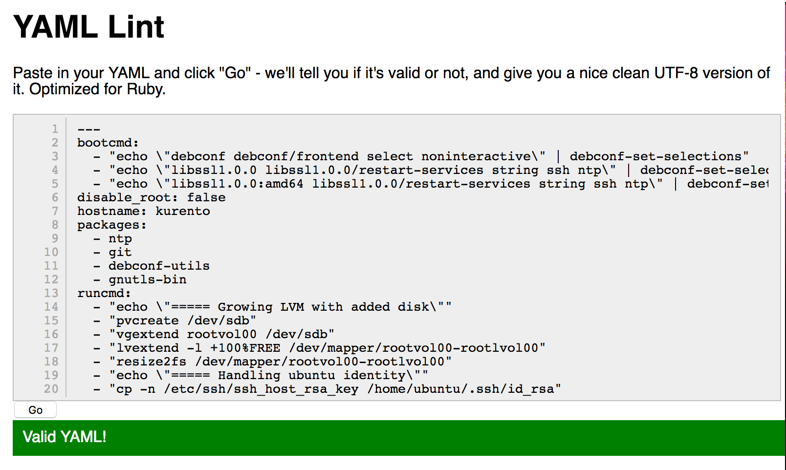

Frequently asked questions
==========================

About project governance
------------------------

Where is this project coming from?
~~~~~~~~~~~~~~~~~~~~~~~~~~~~~~~~~~

The plumbery project is an initiative from software teams of Dimension Data. It has been created by orchestration experts in Europe, and has been endorsed by the global research and development organisation.

Is this software available to anyone?
~~~~~~~~~~~~~~~~~~~~~~~~~~~~~~~~~~~~~

Yes. The software and the documentation have been open-sourced from the outset, so that it can be useful to the global community of IoT and of digital practioners. The plumbery project is based on the [Apache License](https://www.apache.org/licenses/LICENSE-2.0).

Do you accept contributions to this project?
~~~~~~~~~~~~~~~~~~~~~~~~~~~~~~~~~~~~~~~~~~~~

Yes. There are multiple ways for end-users and for non-developers to contribute to this project. For example, if you hit an issue, please report it at GitHub. This is where we track issues and report on corrective actions.

And if you know [how to clone a GitHub project](https://help.github.com/articles/cloning-a-repository/), we are happy to consider [pull requests](https://help.github.com/articles/about-pull-requests/) with your modifications. This is the best approach to submit additional reference configuration files, or updates of the documentation, or even evolutions of the python code.

About project deployment
------------------------

How to install the full system?
~~~~~~~~~~~~~~~~~~~~~~~~~~~~~~~

Use [detailed instructions](installing.rst) that explain what you have to do step by step.

Is it required to know python?
~~~~~~~~~~~~~~~~~~~~~~~~~~~~~~

Fortunately not. Plumbery makes extensive usage of separate configuration files that can be modified at will.

About troubleshooting
---------------------

How to control data sent to cloud-init?
~~~~~~~~~~~~~~~~~~~~~~~~~~~~~~~~~~~~~~~~~~~~

The term `user-data` is naming detailed configuration instructions given to cloud-init.
Plumbery builds `user-data` for each node that has a `cloud-config` statement in the fittings plan.
Data prepared by plumbery can be inspected with the debug flag::

    $ python -m plumbery fittings.yaml deploy -d

In the stream of messages, look for the keyword `#cloud-config` and following lines. For example::

    #cloud-config
    users:
      - default
      - ssh-authorized-keys:
          - ssh-rsa AAAAB3NzaC1yc2EAAAADAQABAAABAQC5QNc7Z+PHF2S4Nr/WGs0aIs3FBkwBvHBP4aBdPb35KEWbeKx+X4iJ3CFY4DCqNPsS01IarrzcKzHkpzDRxptB+6iLQE4y7dvIrkHP8rqXOspbQ4afyHE0uN1Jf6kp4kylAe6zwWg
    ...

If you are not sure that such data is correct YAML syntax, then copy the full text, starting on the keyword `#cloud-config`, and paste it in YAML Lint::

    http://www.yamllint.com

YAML Lint will immediately tell you if data is ok or not:

How to troubleshoot cloud-init?
~~~~~~~~~~~~~~~~~~~~~~~~~~~~~~~

Connect to the target server over SSH. Then check the existence and content of the cloud-init log file::

    $ less /var/log/cloud-init-output.log

If the file does not exist, or if its content does not reflect statements put in the plumbery configuration file, then you can inspect user data that have been uploaded, and then run cloud-init manually::

    $ cd /var/lib/cloud/seed/nocloud-net/
    $ less user-data
    $ sudo cloud-init --debug --file user-data modules --mode final

Check error messages thrown by cloud-init and react accordingly.
