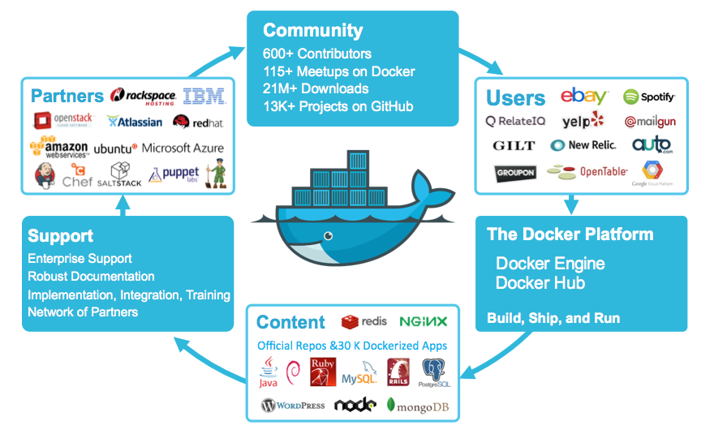

===========
Docker node
===========

Despite the surging interest in containers, the community is still struggling
on the proper setup of a Docker node. In other terms, the handling of containers
is really a breeze compared to previous situation. However, there is a need
to facilitate the deployment of the underlying infrastructure, including the
network and the security.

In this tutorial we demonstrate how to create a class of Docker nodes and deploy
one single node. Of course, you can use this file for yourself, and change it
to better accomodate your requirements. For example, duplicate the last section
of this fittings plan and mention other data centres and regions.

Requirements for this use case
------------------------------

* Add a Network Domain
* Add an Ethernet network
* Deploy a large Ubuntu server
* Provide 32 CPU and 256 MB of RAM to each node
* Add a virtual disk of 100 GB
* Monitor this server in the real-time dashboard
* Assign a public IPv4 address to each node
* Add address translation to ensure end-to-end IP connectivity
* Add firewall rule to accept TCP traffic on port 22 (ssh)
* Combine the virtual disks into a single expanded logical volume (LVM)
* Install a new SSH key to secure remote communications
* Configure SSH to reject passwords and to prevent access from root account
* Install Docker
* Allow non-root account to use Docker

Fittings plan
-------------

Copy the text below and put it in a text file named ``fittings.yaml``:

.. code-block:: yaml
   :linenos:

    ---

    information:
      - "Orchestration of fully-functional Docker node that you can access remotely and securely over the Internet."
      - "Duplicate the 7 lines at the end of the fittings plan to add nodes at multiple locations."

    defaults:

      # the same network domain is used at various facilities
      #
      domain:
        name: DockerFox
        description: "Docker nodes"
        service: essentials
        ipv4: auto

      # the same ethernet configuration is used at various facilities
      #
      ethernet:
        name: DockerNetwork
        subnet: 192.168.20.0

      # default settings for a Docker node
      #
      dockerNode:

        description: "#docker #ubuntu"

        information:
          - "ssh ubuntu@{{ node.public }}"
          - "docker info"
          - "docker run hello-world"

        appliance: 'Ubuntu 14'

        # plenty of compute power
        #
        cpu: 32
        memory: 256

        # enough storage space
        #
        disks:
          - 1 100 standard

        # make the node accessible from the Internet
        #
        glue:
          - internet 22

        # allow for monitoring from the global dashboard
        #
        monitoring: essentials

        # contextualise this node
        #
        cloud-config:

          hostname: "{{ node.name }}"

          packages:
            - ntp

          write_files:

            - path: /root/hosts.awk
              content: |
                #!/usr/bin/awk -f
                /^{{ node.private }}/ {next}
                /^{{ node.ipv6 }}/ {next}
                {print}
                END {
                 print "{{ node.private }}    {{ node.name }}"
                 print "{{ node.ipv6 }}    {{ node.name }}"
                }

          runcmd:

            - echo "===== Growing LVM with added disk"
            - pvcreate /dev/sdb
            - vgextend rootvol00 /dev/sdb
            - lvextend -l +100%FREE /dev/mapper/rootvol00-rootlvol00
            - resize2fs /dev/mapper/rootvol00-rootlvol00

            - echo "===== Handling ubuntu identity"
            - cp -n /etc/ssh/ssh_host_rsa_key /home/ubuntu/.ssh/id_rsa
            - cp -n /etc/ssh/ssh_host_rsa_key.pub /home/ubuntu/.ssh/id_rsa.pub
            - chown ubuntu:ubuntu /home/ubuntu/.ssh/*
            - sed -i "/StrictHostKeyChecking/s/^.*$/    StrictHostKeyChecking no/" /etc/ssh/ssh_config

            - echo "===== Updating /etc/hosts"
            - cp -n /etc/hosts /etc/hosts.original
            - awk -f /root/hosts.awk /etc/hosts >/etc/hosts.new && mv /etc/hosts.new /etc/hosts

            - echo "===== Installing Docker Engine"
            - apt-get remove apache2 -y
            - apt-get autoremove -y
            - curl -sSL https://get.docker.com/ | sh
            - usermod -aG docker ubuntu

      # default settings for all nodes created by plumbery
      #
      cloud-config:

        # ask plumbery to generate a random key pair
        #
        ssh_keys:
          rsa_private: |
            {{ key.rsa_private }}
          rsa_public: "{{ key.rsa_public }}"

        # the ubuntu account will use this key as well
        #
        users:
          - default

          - name: ubuntu
            sudo: 'ALL=(ALL) NOPASSWD:ALL'
            ssh-authorized-keys:
              - "{{ key.rsa_public }}"
              - "{{ local.rsa_public }}"

        # prevent remote access from root
        #
        disable_root: true

        # force authentication with SSH key -- no password allowed
        #
        ssh_pwauth: false

    # duplicate the below to deploy another node at another location, e.g. AU10 in dd-au, etc
    #
    ---
    locationId: NA12
    regionId: dd-na

    blueprints:

      - docker:
          nodes:
            - docker-NA12:
                default: dockerNode

Deployment commands
-------------------

.. sourcecode:: bash

    $ python -m plumbery fittings.yaml deploy

These commands will build fittings as per the provided plan, start the server
and bootstrap it.

You can find the public address assigned to the Docker node like this:

.. sourcecode:: bash

    $ python -m plumbery fittings.yaml information

Follow-up commands
------------------

In this use case you can use the IPv4 assigned to the node for direct ssh
connection.

.. sourcecode:: bash

    $ ssh ubuntu@<ipv4_here>

You will have to accept the new host, and authentication will be based on
the SSH key communicated to the node by Plumbery.

.. sourcecode:: bash

    $ docker run hello-world

This command is self-explanatory and validates the setup of Docker.

Destruction commands
--------------------

Launch following command to remove all resources involved in the fittings plan:

.. sourcecode:: bash

    $ python -m plumbery fittings.yaml dispose

