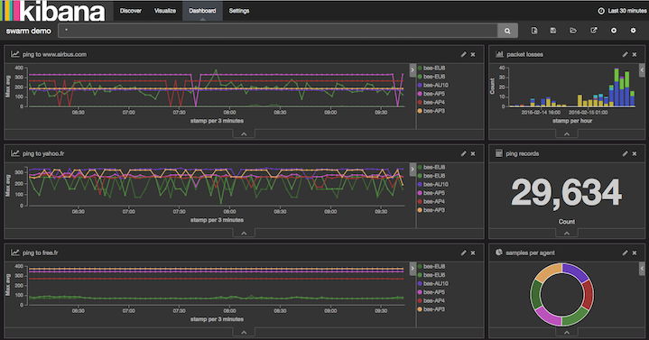
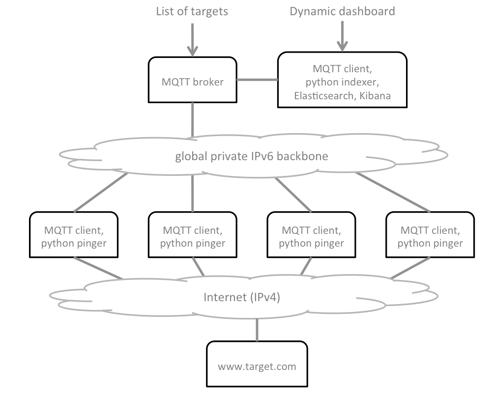

================================================================
Swarm of IP pingers coordinated with MQTT and reported in Kibana
================================================================

The objective of this use case is to deploy a swarm of network pingers at
multiple data centres. MQTT is used across the swarm to coordinate the pingers
and to consolidate data. The back-end IPv6 infrastructure provided by
Dimension Data is used to streamline MQTT traffic across agents and broker,
in a secured backbone. Ping results are recorded in a centralised
Elasticsearch server, and shown in a Kibana interactive dashboard.

The network
and security services coming with cloud services from Dimension Data are used
to control access and to secure remote access to various building blocks of the
architecture.

Project credits: `Swarming project from Mathieu Lecarme`_

Requirements for this use case
------------------------------

The diagram below provides some essential understanding of the architecture
to be deployed:

There are a number of actions involved in the overall deployment, and plumbery
will assist to orchestrate all of them, except the custom configuration of the Kibana dashboard:

* Deploy a MQTT broker in the focus data centre -- the queen
* Deploy an Elasticsearch & Kibana server in the same data centre -- the dashboard
* Deploy pinger nodes in multiple data centres world-wide -- the bees
* Create a Network Domain at each location
* Create an Ethernet network at each location
* Allow IPv6 traffic between MQTT clients (the bees) and the broker (the queen)
* Add nodes to the automated monitoring dashboard
* Assign public IPv4 addresses to each node
* Add address translation to ensure SSH access to the nodes from the internet
* Add firewall rules to accept TCP traffic on port 22 (ssh)
* Add firewall rule to allow web traffic to the dashboard server
* Update `etc/hosts` to bind IPv6 addresses to host names
* Manage keys to suppress passwords in SSH connections
* Install MQTT server at the queen node
* Install MQTT client software at bees and at the dashboard
* Install pingers in python at bee nodes
* Install indexer programs in python at the dashboard node
* Install Elasticsearch and Kibana at the dashboard node
* Feed the list of addresses to ping at the queen node
* Configure Kibana to deliver the visual reporting dashboard

Fittings plan
-------------

The plan below demonstrates multiple interesting tips and tricks:

* Provide SSH access to all nodes via public IPv4, NAT, and firewall settings
* Management of SSH keys to enable secured communications without passwords
* Allow private IPv6 communications between remote data centres and the focus data centre
* Automatic registration of all nodes to the monitoring services provided by Dimension Data
* Update of `etc/hosts` with IPv6
* Install swarming software in python directly from GitHub repository
* Turn a python command to a service that can be started and stopped on-demand
* Remove Apache, and install Nginx instead
* Install an interactive dashboard with Elasticseach and Kibana
* Configure Nginx as efficient and secured proxy to Kibana
* Orchestrate generation and configuration of web password to the dashboard
* Automate the installation of Oracle 8 JDK
* User documentation of the infrastructure is put directly in the fittings plan

`Download this fittings plan`_ if you want to hack it for yourself. This is part of `the demonstration
directory of the plumbery project`_ at GitHub. Alternatively, you can copy the
text below and put it in a text file named ``fittings.yaml``.

.. code-block:: yaml
   :linenos:

    ---

    information:
      - "These fittings plan are aiming to deploy multiple pingers connected"
      - "to a MQTT server and to a Kibana dashboard"

    links:
      documentation: https://plumbery.readthedocs.org/en/latest/tutorial.mqtt.pinger.swarm.html
      credit: https://github.com/athoune/swarming

    defaults:

      # deploy a limited number of bugs by default
      #
      blueprints: queen drones

      # the same network domain is used at various facilities
      #
      domain:
        name: PingerSwarmFox
        description: "Demonstration of MQTT with multiple pingers"
        ipv4: auto

      # the same ethernet configuration is used at various facilities
      #
      ethernet:
        name: SwarmNetwork
        subnet: 10.0.0.0

      # default settings for a remote probe
      #
      bee:

        description: "#swarm #bee #mqtt #ubuntu"

        information:
          - "a pinger controlled via MQTT"
          - "troubleshoot with:"
          - "$ ssh ubuntu@{{ node.public }}"

        appliance: 'Ubuntu 14'

        cpu: 2
        memory: 3

        glue:
          - internet 22

        monitoring: essentials

        cloud-config:

          hostname: "{{ node.name }}"

          packages:
            - ntp
            - mosquitto-clients
            - git
            - python-pip

          write_files:

            - path: /root/hosts.awk
              content: |
                #!/usr/bin/awk -f
                /^{{ node.private }}/ {next}
                /^{{ node.ipv6 }}/ {next}
                /^{{ dd-au::AU10::queen.ipv6 }}/ {next}
                {print}
                END {
                 print "{{ node.private }}    {{ node.name }}"
                 print "{{ node.ipv6 }}    {{ node.name }}"
                 print "{{ dd-au::AU10::queen.ipv6 }}    queen"
                }

            - path: /etc/init/swarm-pinger.conf
              content: |
                description "Swarm pinger"
                start on runlevel [2345]
                stop on runlevel [!2345]
                start on startup
                exec /home/ubuntu/swarming/swarming.py queen

          runcmd:

            - echo "===== Handling ubuntu identity"
            - cp -n /etc/ssh/ssh_host_rsa_key /home/ubuntu/.ssh/id_rsa
            - cp -n /etc/ssh/ssh_host_rsa_key.pub /home/ubuntu/.ssh/id_rsa.pub
            - chown ubuntu:ubuntu /home/ubuntu/.ssh/*
            - sed -i "/StrictHostKeyChecking/s/^.*$/    StrictHostKeyChecking no/" /etc/ssh/ssh_config

            - echo "===== Updating /etc/hosts"
            - cp -n /etc/hosts /etc/hosts.original
            - awk -f /root/hosts.awk /etc/hosts >/etc/hosts.new && mv /etc/hosts.new /etc/hosts

            - echo "===== Installing swarming software"
            - cd /home/ubuntu
            - git clone https://github.com/bernard357/swarming.git
            - cd swarming
            - pip install -r requirements.txt

            - echo "===== Running swarming software"
            - service swarm-pinger start

      # default settings for all nodes created by plumbery
      #
      cloud-config:

        # plumbery generates a random key pair
        #
        ssh_keys:
          rsa_private: |
            {{ key.rsa_private }}
          rsa_public: "{{ key.rsa_public }}"

        users:
          - default

          - name: ubuntu
            sudo: 'ALL=(ALL) NOPASSWD:ALL'
            ssh-authorized-keys:
              - "{{ key.rsa_public }}"
              - "{{ local.rsa_public }}"

          - name: root
            ssh-authorized-keys:
              - "{{ key.rsa_public }}"
              - "{{ local.rsa_public }}"

        disable_root: false
        ssh_pwauth: false

    ---
    locationId: AU10
    regionId: dd-au

    blueprints:

      - queen:

          ethernet:
            accept:
              - dd-ap::AP3::SwarmNetwork
              - dd-ap::AP4::SwarmNetwork
              - dd-ap::AP5::SwarmNetwork
              - dd-au::AU11::SwarmNetwork
              - dd-eu::EU6::SwarmNetwork
              - dd-eu::EU8::SwarmNetwork
              - dd-na::NA9::SwarmNetwork
              - dd-na::NA12::SwarmNetwork

          nodes:

            - queen: # the MQTT server

                description: "#swarm #queen #mqtt #ubuntu"

                information:
                  - "a MQTT broker to control a swarm of pingers"
                  - "$ ssh ubuntu@{{ node.public }}"
                  - "change target addresses with something like the following:"
                  - '$ mosquitto_pub -t watch -m "free.fr yahoo.fr yahoo.cn" -q 1'
                  - "check the flow of pings with:"
                  - '$ mosquitto_sub -t "ping/+" -v'

                appliance: 'Ubuntu 14'

                cpu: 2
                memory: 3

                glue:
                  - internet 22

                monitoring: essentials

                cloud-config:

                  hostname: "{{ node.name }}"

                  apt_sources:
                    - source: "ppa:mosquitto-dev/mosquitto-ppa"

                  packages:
                    - ntp
                    - mosquitto
                    - mosquitto-clients
                    - git
                    - python-pip

                  write_files:

                    - path: /root/hosts.awk
                      content: |
                        #!/usr/bin/awk -f
                        /^{{ node.private }}/ {next}
                        /^{{ queen.ipv6 }}/ {next}
                        /^{{ dashboard.ipv6 }}/ {next}
                        /^{{ dd-na::NA9::bee-NA9.ipv6 }}/ {next}
                        {print}
                        END {
                         print "{{ node.private }}    {{ node.name }}"
                         print "{{ queen.ipv6 }}    queen"
                         print "{{ dashboard.ipv6 }}    dashboard"
                         print "{{ dd-na::NA9::bee-NA9.ipv6 }}    bee-NA9"
                        }

                  runcmd:

                    - echo "===== Handling ubuntu identity"
                    - cp -n /etc/ssh/ssh_host_rsa_key /home/ubuntu/.ssh/id_rsa
                    - cp -n /etc/ssh/ssh_host_rsa_key.pub /home/ubuntu/.ssh/id_rsa.pub
                    - chown ubuntu:ubuntu /home/ubuntu/.ssh/*
                    - sed -i "/StrictHostKeyChecking/s/^.*$/    StrictHostKeyChecking no/" /etc/ssh/ssh_config

                    - echo "===== Updating /etc/hosts"
                    - cp -n /etc/hosts /etc/hosts.original
                    - awk -f /root/hosts.awk /etc/hosts >/etc/hosts.new && mv /etc/hosts.new /etc/hosts

                    - echo "===== Installing swarming software"
                    - cd /home/ubuntu
                    - git clone https://github.com/bernard357/swarming.git
                    - cd swarming
                    - pip install -r requirements.txt

            - dashboard: # the Kibana and Elasticsearch engine

                description: "#swarm #dashboard #kibana #ubuntu"

                information:
                  - "a web dashboard to visualize pings:"
                  - "http://{{ dashboard.public }}"
                  - "authenticate with 'dashboard' and '{{ dashboard.secret }}'"
                  - "troubleshoot with:"
                  - "$ ssh ubuntu@{{ node.public }}"
                  - "check the feeding of elasticsearch with:"
                  - "$ curl 'http://localhost:9200/_cat/indices?v'"

                appliance: 'Ubuntu 14'

                cpu: 2
                memory: 3

                glue:
                  - internet 22 80

                monitoring: essentials

                cloud-config:

                  hostname: "{{ node.name }}"

                  bootcmd:

                    # remove apache
                    - apt-get remove apache2 -y
                    - apt-get autoremove -y

                    # automate acceptance of oracle licence
                    - echo "oracle-java8-installer shared/accepted-oracle-license-v1-1 select true" | sudo debconf-set-selections
                    - echo "oracle-java8-installer shared/accepted-oracle-license-v1-1 seen true" | sudo debconf-set-selections

                  apt_sources:
                    - source: "ppa:mosquitto-dev/mosquitto-ppa"
                    - source: "ppa:webupd8team/java"

                  packages:
                    - ntp
                    - mosquitto-clients
                    - git
                    - oracle-java8-installer
                    - python-pip
                    - nginx
                    - apache2-utils

                  write_files:

                    - path: /root/hosts.awk
                      content: |
                        #!/usr/bin/awk -f
                        /^{{ node.private }}/ {next}
                        /^{{ queen.ipv6 }}/ {next}
                        /^{{ dashboard.ipv6 }}/ {next}
                        /^{{ dd-na::NA9::bee-NA9.ipv6 }}/ {next}
                        {print}
                        END {
                         print "{{ node.private }}    {{ node.name }}"
                         print "{{ queen.ipv6 }}    queen"
                         print "{{ dashboard.ipv6 }}    dashboard"
                         print "{{ dd-na::NA9::bee-NA9.ipv6 }}    bee-NA9"
                        }

                    - path: /etc/nginx/sites-available/default.swarm
                      content: |
                        server {
                            listen 80;

                            server_name {{ node.public }};

                            auth_basic "Restricted Access";
                            auth_basic_user_file /etc/nginx/htpasswd.users;

                            location / {
                                proxy_pass http://localhost:5601;
                                proxy_http_version 1.1;
                                proxy_set_header Upgrade $http_upgrade;
                                proxy_set_header Connection 'upgrade';
                                proxy_set_header Host $host;
                                proxy_cache_bypass $http_upgrade;
                            }
                        }

                    - path: /etc/init/swarm-indexer.conf
                      content: |
                        description "Swarm indexer"
                        start on runlevel [2345]
                        stop on runlevel [!2345]
                        start on startup
                        exec /home/ubuntu/swarming/indexer.py queen

                  runcmd:

                    - echo "===== Handling ubuntu identity"
                    - cp -n /etc/ssh/ssh_host_rsa_key /home/ubuntu/.ssh/id_rsa
                    - cp -n /etc/ssh/ssh_host_rsa_key.pub /home/ubuntu/.ssh/id_rsa.pub
                    - chown ubuntu:ubuntu /home/ubuntu/.ssh/*
                    - sed -i "/StrictHostKeyChecking/s/^.*$/    StrictHostKeyChecking no/" /etc/ssh/ssh_config

                    - echo "===== Updating /etc/hosts"
                    - cp -n /etc/hosts /etc/hosts.original
                    - awk -f /root/hosts.awk /etc/hosts >/etc/hosts.new && mv /etc/hosts.new /etc/hosts

                    - echo "===== Installing Elasticsearch, Kibana"
                    - cd /root
                    - wget -qO - https://packages.elastic.co/GPG-KEY-elasticsearch | sudo apt-key add -
                    - echo "deb http://packages.elastic.co/elasticsearch/2.x/debian stable main" | sudo tee -a /etc/apt/sources.list.d/elasticsearch-2.x.list
                    - echo "deb http://packages.elastic.co/kibana/4.4/debian stable main" | sudo tee -a /etc/apt/sources.list.d/kibana-4.4.x.list
                    - apt-get update
                    - apt-get install elasticsearch kibana
                    - update-rc.d elasticsearch defaults 95 10
                    - service elasticsearch start
                    - update-rc.d kibana defaults 96 9
                    - service kibana start

                    - echo "===== Securing web access"
                    - cp -n /etc/nginx/sites-available/default /etc/nginx/sites-available/default.original
                    - cp /etc/nginx/sites-available/default.swarm /etc/nginx/sites-available/default
                    - htpasswd -cb /etc/nginx/htpasswd.users dashboard {{ dashboard.secret }}
                    - service nginx restart

                    - echo "===== Installing swarming software"
                    - cd /home/ubuntu
                    - git clone https://github.com/bernard357/swarming.git
                    - cd swarming
                    - pip install -r requirements.txt

                    - echo "===== Running swarming software"
                    - service swarm-indexer restart

      - drones:

          nodes:
            - bee-AU10:
                default: bee

    ---
    locationId: AP3
    regionId: dd-ap

    blueprints:

      - drones:

          ethernet:
            accept:
              - dd-au::AU10::SwarmNetwork

          nodes:
            - bee-AP3:
                default: bee

    ---
    locationId: AP4
    regionId: dd-ap

    blueprints:

      - bees:

          ethernet:
            accept:
              - dd-au::AU10::SwarmNetwork

          nodes:
            - bee-AP4:
                default: bee

    ---
    locationId: AP5
    regionId: dd-ap

    blueprints:

      - bees:

          ethernet:
            accept:
              - dd-au::AU10::SwarmNetwork

          nodes:
            - bee-AP5:
                default: bee

    ---
    locationId: AU11
    regionId: dd-au

    blueprints:

      - drones:

          ethernet:
            accept:
              - dd-au::AU10::SwarmNetwork

          nodes:
            - bee-AU11:
                default: bee

    ---
    locationId: EU6
    regionId: dd-eu

    blueprints:

      - drones:

          ethernet:
            accept:
              - dd-au::AU10::SwarmNetwork

          nodes:
            - bee-EU6:
                default: bee

    ---
    locationId: EU8
    regionId: dd-eu

    blueprints:

      - bees:

          ethernet:
            accept:
              - dd-au::AU10::SwarmNetwork

          nodes:
            - bee-EU8:
                default: bee

    ---
    locationId: NA9
    regionId: dd-na

    blueprints:

      - bees:

          ethernet:
            accept:
              - dd-au::AU10::SwarmNetwork

          nodes:
            - bee-NA9:
                default: bee

    ---
    locationId: NA12
    regionId: dd-na

    blueprints:

      - drones:

          ethernet:
            accept:
              - dd-au::AU10::SwarmNetwork

          nodes:
            - bee-NA12:
                default: bee

Deployment commands
-------------------

For this tutorial, plumbery has to connect separately to multiple data centres
and to apply several changes in multiple waves.

.. sourcecode:: bash

    $ python -m plumbery fittings.yaml deploy

This command will build fittings as per the provided plan, and start
servers as well. Look at messages displayed by plumbery while it is
working, so you can monitor what's happening.

Follow-up commands
------------------

At the end of the deployment, plumbery will display on screen some instructions
to help you move forward. You can ask plumbery to display this information
at any time with the following command:

.. sourcecode:: bash

    $ python -m plumbery fittings.yaml information

What's coming next? You may want to connect to the queen node in ssh and
check the stream of records coming from pingers to the broker via MQTT.

.. sourcecode:: bash

    $ ssh ubuntu@<IPv4 of queen node>

Subscribe to the MQTT stream from the command line like this:

.. sourcecode:: bash

    $ mosquitto_sub -t "ping/+" -v

After some seconds you will see records popping up from various parts of the world.

Now, let's move to the dashboard server to check the feeding of the elasticsearch
server.

.. sourcecode:: bash

    $ ssh ubuntu@<IPv4 of dashboard node>

From there you can validate the number of records in the index named 'swarm'
with the following command:

.. sourcecode:: bash

    $ curl 'http://localhost:9200/_cat/indices?v'

Repeat the command multiple times and check the increment of documents indexed
by Elasticsearch.

If everything is looking fine at this stage, then you are allowed to move
to the configuration of the Kibana interactive dashboard. In a browser window,
type the public IPv4 address of the dashboard server. When asked for it, provide
the name and the password that were mentioned by plumbery during the deployment
of the fittings plan.

From there you can select the 'swarm' index and configure the dashboard as per your
very specific needs.

Change the list of addresses to ping
------------------------------------

Ask all pingers to change the list of targets by acting at the MQTT broker.
For this, go to the queen node and type a command like the following:

.. sourcecode:: bash

   $ mosquitto_pub -t watch -m "free.fr yahoo.fr yahoo.cn" -q 1

Destruction commands
--------------------

At the end of the demonstration, you may want to reduce costs with the following:

.. sourcecode:: bash

    $ python -m plumbery fittings.yaml dispose

.. _`Swarming project from Mathieu Lecarme`: https://github.com/athoune/swarming
.. _`Download this fittings plan`: https://github.com/bernard357/plumbery/blob/master/demos/mqtt.pinger.swarm.yaml
.. _`the demonstration directory of the plumbery project`: https://github.com/bernard357/plumbery/tree/master/demos